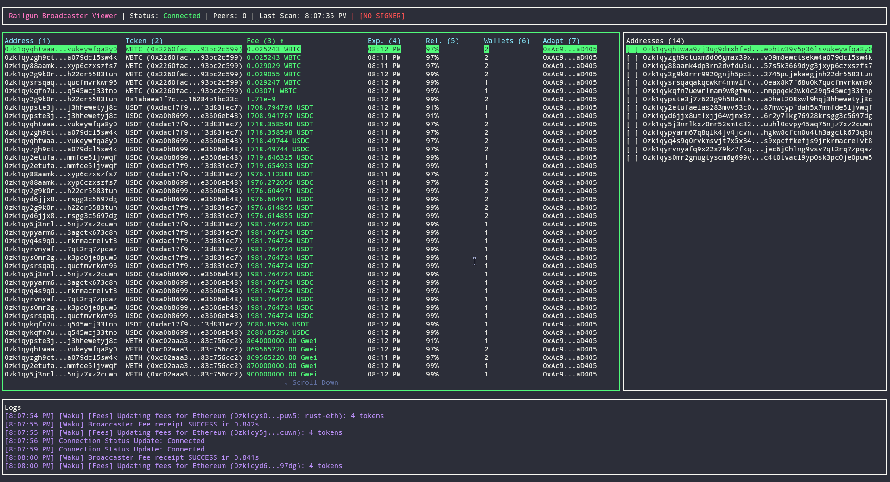

# Railgun Broadcaster Viewer



A powerful, interactive Terminal User Interface (TUI) to monitor Railgun broadcasters on the Waku
network. This tool visualizes real-time data, allowing node operators and developers to track fees,
connectivity, and reliability scores across different chains.

## Features

- **Interactive Dashboard**: Rich TUI built with `Ink` and React.
- **Real-time Monitoring**: Continuously scans the Waku p2p network for broadcasters.
- **Sorting & Filtering**:
  - Sort by any column (Fee, Reliability, Token, etc.).
  - Filter by text (Address, Token).
  - Filter by specific Broadcaster Address.
- **Deep Inspection**: View detailed fees, expiration times, and token support.
- **Log Inspection**: Scrollable, pausable log panel for debugging connection events.
- **Cross-Chain**: Configurable for Ethereum, Polygon, Arbitrum, Sepolia, etc.

## Installation

1.  **Clone the repository**:

    ```bash
    git clone https://github.com/railgun-community/broadcast-viewer.git
    cd broadcast-viewer
    ```

2.  **Install dependencies**:

    ```bash
    npm install
    ```

3.  **Build**:
    ```bash
    npm run build
    ```

## Quick Start

Using a Trusted Fee Signer is recommended to validate fees against a baseline and prevent price
gouging.

```bash
# Ethereum Mainnet (No Signer - Default)
# CAUTION: This removes fee protections and displays all broadcasters
npm start

# Use Community Trusted Signers
npm start -- --railway    # Use Railway Wallet signers
npm start -- --terminal   # Use Terminal Wallet signers
npm start -- --railway --terminal # Use both

# Custom Signer
npm start -- --signer <TRUSTED_SIGNER_PUBLIC_KEY>
```

### Trusted Fee Signers (Community)

The tool includes built-in public keys for major community wallets:

- **Railway Wallet**: `--railway` (Highlighted in Cyan)
- **Terminal Wallet**: `--terminal` (Highlighted in Magenta)

Broadcasters matching these signers are highlighted in the UI for easy identification.

## Keyboard Controls

| Key                 | Action                                                                       |
| :------------------ | :--------------------------------------------------------------------------- |
| **Navigation**      |                                                                              |
| `Tab` / `Shift+Tab` | Switch focus between panels (Table, Address List, Logs)                      |
| `Up` / `Down`       | Scroll lists or table rows                                                   |
| `PageUp` / `PageDn` | Scroll by page                                                               |
| `Ctrl+u` / `Ctrl+d` | Scroll by half-page                                                          |
| **Table Actions**   |                                                                              |
| `1` - `7`           | Sort by specific column (press again to toggle ASC/DESC)                     |
| `/`                 | **Search Mode**: Type to filter table by text                                |
| **Address List**    |                                                                              |
| `Space`             | Toggle selection of an address (filters table to show only that broadcaster) |
| **Global**          |                                                                              |
| `Esc`               | **Freeze Mode**: Pause all updates to inspect data. Also exits Search Mode.  |
| `Ctrl+c`            | Quit application                                                             |

## Configuration

Options can be passed via CLI flags or a `config.json` file.

| Option           | Description                                | Default |
| :--------------- | :----------------------------------------- | :------ |
| `--chain-id <n>` | Chain ID to monitor                        | `1`     |
| `--railway`      | Add Railway Wallet trusted signers         | `false` |
| `--terminal`     | Add Terminal Wallet trusted signers        | `false` |
| `--signer <key>` | Custom Trusted Fee Signer Key (repeatable) | `[]`    |
| `--no-signer`    | Run without any Trusted Fee Signer         | `true`  |
| `--refresh <ms>` | Refresh interval in milliseconds           | `30000` |
| `--debug`        | Enable verbose Waku debugging              | `false` |
| `--log-to-file`  | Save logs to `broadcaster-viewer.log`      | `false` |

## Understanding the Data

- **Fee**: The cost per unit of gas charged by the broadcaster.
  - _Calculation_: `Fee = (Gas Token Price / Fee Token Price) * (1 + Profit Margin)`
- **Reliability**: Historical uptime/success rate (0-100%).
- **Wallets**: Number of concurrent transactions the broadcaster can process.

## License

MIT
